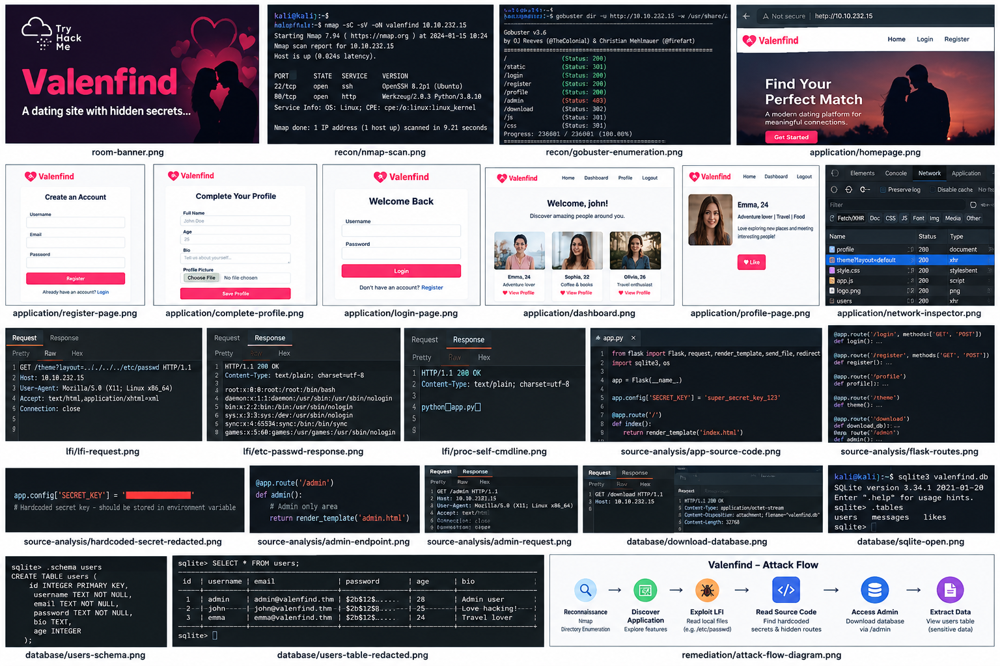

# 💘 Valenfind — TryHackMe Walkthrough

<div align="center">



### Professional TryHackMe CTF Walkthrough • Web Application Security • OWASP Inspired

[](https://tryhackme.com/)
[](#)
[](#)
[](#)
[](#)

</div>

---

## 📌 Repository Overview

**Valenfind** is a beginner-friendly **TryHackMe Capture The Flag (CTF)** room focused on discovering and exploiting vulnerabilities in a Python Flask web application. This repository documents the entire penetration testing process using a professional methodology suitable for cybersecurity portfolios, technical interviews, and learning web exploitation techniques.

Unlike public write-ups, this documentation is rewritten from scratch, follows a structured security assessment workflow, and **redacts sensitive challenge answers and flags** to preserve academic integrity.

> ⚠️ This repository is intended **only for educational purposes and authorized security training** using the TryHackMe lab environment.

---

# 🎯 Objectives

This walkthrough demonstrates how an attacker can move from reconnaissance to sensitive data exposure through a vulnerable web application while explaining every step from a defender's perspective.

### Skills Demonstrated

| Security Domain         | Demonstrated Skills                                   |
| ----------------------- | ----------------------------------------------------- |
| Reconnaissance          | Nmap scanning, service detection, version enumeration |
| Enumeration             | Directory discovery with Gobuster                     |
| Web Testing             | Endpoint discovery and request inspection             |
| Vulnerability Analysis  | Local File Inclusion (LFI) identification             |
| Source Code Review      | Flask application analysis                            |
| Sensitive Data Exposure | Hardcoded secret discovery                            |
| Database Security       | SQLite inspection and data extraction                 |
| Secure Development      | OWASP-aligned remediation recommendations             |

---

# 🧠 What You'll Learn

* Web application reconnaissance methodology.
* Identifying hidden API endpoints.
* Understanding **Local File Inclusion (LFI)** vulnerabilities.
* Reading exposed application source code.
* Discovering insecure hardcoded secrets.
* Analyzing SQLite databases obtained through exploitation.
* Understanding how one vulnerability can lead to complete application compromise.
* Applying secure coding recommendations for Flask applications.

---

# 🗺️ Attack Path Overview

The challenge follows a realistic web exploitation chain.

```text
Target Enumeration
        │
        ▼
Open Flask Web Service
        │
        ▼
Directory & Endpoint Discovery
        │
        ▼
Dynamic Layout Parameter Analysis
        │
        ▼
Local File Inclusion (LFI)
        │
        ▼
Application Source Code Exposure
        │
        ▼
Hardcoded Administrative Secret Discovery
        │
        ▼
Authorized Endpoint Abuse
        │
        ▼
SQLite Database Extraction
        │
        ▼
Sensitive Information Disclosure
```

This repository explains **why each step works**, not just what commands were executed.

---

# 🧱 Attack Methodology

The walkthrough follows an industry-inspired penetration testing workflow.

| Phase                          | Description                                                                  |
| ------------------------------ | ---------------------------------------------------------------------------- |
| **1. Reconnaissance**          | Identify exposed services and technologies.                                  |
| **2. Enumeration**             | Discover accessible directories and API endpoints.                           |
| **3. Application Exploration** | Register, authenticate, inspect requests, and map application functionality. |
| **4. Vulnerability Discovery** | Test input parameters for file inclusion behavior.                           |
| **5. Exploitation**            | Confirm LFI and retrieve internal application resources.                     |
| **6. Source Code Analysis**    | Review Flask application logic and hidden functionality.                     |
| **7. Database Analysis**       | Safely inspect exposed SQLite data.                                          |
| **8. Security Remediation**    | Recommend secure development fixes using OWASP guidance.                     |

---

# 🛠️ Tools Used

| Tool                        | Purpose                                      |
| --------------------------- | -------------------------------------------- |
| **Nmap**                    | Network reconnaissance and service detection |
| **Gobuster**                | Directory and endpoint enumeration           |
| **Firefox Developer Tools** | HTTP request inspection                      |
| **Burp Suite Community**    | Manual request modification                  |
| **curl**                    | Interacting with authenticated endpoints     |
| **SQLite3**                 | Database inspection                          |
| **Linux Terminal**          | Enumeration and exploitation workflow        |

---

# 🖥️ Technology Stack

| Component              | Technology                   |
| ---------------------- | ---------------------------- |
| Operating System       | Linux                        |
| Web Framework          | Python Flask                 |
| Database               | SQLite                       |
| Authentication         | Session-based authentication |
| API Communication      | HTTP GET / POST              |
| Vulnerability Category | Local File Inclusion (LFI)   |

---

# 📂 Repository Structure

```text
Valenfind-TryHackMe-Walkthrough
│
├── README.md
│
├── Documentation/
│   ├── Valenfind_Documentation.md
│   └── Valenfind_Documentation.docx
│
├── docs/
│   ├── index.md
│   ├── methodology.md
│   ├── exploitation.md
│   ├── remediation.md
│   └── assets/
│       ├── room-banner.png
│       ├── architecture.png
│       ├── recon/
│       ├── enumeration/
│       ├── application/
│       ├── lfi/
│       ├── source-analysis/
│       ├── database/
│       └── remediation/
│
├── Resources/
│   ├── notes.md
│   ├── tools-used.md
│   └── references.md
│
├── SECURITY.md
├── CONTRIBUTING.md
├── CODE_OF_CONDUCT.md
└── LICENSE
```

The repository is organized for both GitHub browsing and GitHub Pages deployment.

---

# 🔍 Walkthrough Highlights

## Phase 1 — Reconnaissance

* Network scanning.
* Service identification.
* Web server fingerprinting.

📷 Screenshot

```text
docs/assets/recon/nmap-scan.png
```

---

## Phase 2 — Enumeration

* Directory brute forcing.
* Hidden endpoint discovery.
* Application mapping.

📷 Screenshot

```text
docs/assets/recon/gobuster.png
```

---

## Phase 3 — Web Application Exploration

* Account registration.
* Authentication.
* Dashboard exploration.
* HTTP request inspection.
* Parameter analysis.

📷 Screenshots

```text
docs/assets/application/register.png
docs/assets/application/login.png
docs/assets/application/dashboard.png
```

---

## Phase 4 — Local File Inclusion (LFI)

The application exposes a vulnerable parameter responsible for dynamically loading page layouts.

The walkthrough explains:

* Parameter analysis.
* Path traversal testing.
* LFI confirmation.
* File disclosure impact.

📷 Screenshots

```text
docs/assets/lfi/endpoint.png
docs/assets/lfi/traversal.png
docs/assets/lfi/passwd.png
```

---

## Phase 5 — Source Code Review

The exposed Flask application source reveals implementation details that become valuable during the assessment.

Topics covered include:

* Flask routing.
* File handling logic.
* Authentication flow.
* Administrative functionality.
* Secret management mistakes.

📷 Screenshots

```text
docs/assets/source-analysis/app-source.png
docs/assets/source-analysis/admin-endpoint.png
```

> Sensitive values shown inside the source code have been **redacted** in this repository.

---

## Phase 6 — Database Analysis

The documentation explains how SQLite databases can be inspected after successful exploitation.

Covered topics include:

* SQLite structure.
* Table inspection.
* User record analysis.
* Identifying sensitive information.

📷 Screenshots

```text
docs/assets/database/download-db.png
docs/assets/database/sqlite-users.png
```

> Challenge answers and sensitive records are intentionally hidden.

---

## Phase 7 — Security Remediation

The final section explains how developers could prevent the discovered vulnerabilities.

Recommendations include:

* Input validation.
* Secure file handling.
* Secret management.
* Environment variables.
* Access control.
* Least privilege.
* Secure Flask configuration.

---

# 🧩 Vulnerability Summary

| Vulnerability                    | Impact                                    |
| -------------------------------- | ----------------------------------------- |
| Local File Inclusion             | Arbitrary server-side file disclosure     |
| Path Traversal                   | Access to unintended filesystem locations |
| Hardcoded Secrets                | Exposure of administrative credentials    |
| Sensitive Information Disclosure | Unauthorized access to internal resources |
| Insecure File Handling           | Application source code exposure          |

The walkthrough explains each vulnerability using an educational approach rather than simply revealing the solution.

---

# 🛡️ Security Concepts Covered

* Local File Inclusion (LFI)
* Directory Traversal
* Secure File Handling
* Flask Security Best Practices
* HTTP Request Manipulation
* API Authentication
* SQLite Security
* OWASP Web Security Principles
* Sensitive Data Exposure
* Secure Secret Management

---

# 📖 Documentation Included

| File                                         | Description                                    |
| -------------------------------------------- | ---------------------------------------------- |
| `README.md`                                  | Portfolio landing page and repository overview |
| `Documentation/Valenfind_Documentation.md`   | Complete technical walkthrough                 |
| `Documentation/Valenfind_Documentation.docx` | Professional report version                    |
| `docs/index.md`                              | GitHub Pages walkthrough                       |
| `docs/methodology.md`                        | Testing methodology                            |
| `docs/exploitation.md`                       | Exploitation workflow                          |
| `docs/remediation.md`                        | Security recommendations                       |
| `Resources/notes.md`                         | Commands, payloads, and notes                  |

---

# 🌐 GitHub Pages Documentation

A complete documentation website is included inside the `docs/` directory.

### Website Sections

* Executive Summary
* Lab Information
* Reconnaissance
* Enumeration
* Vulnerability Discovery
* Exploitation
* Source Code Analysis
* Database Analysis
* Security Remediation
* Lessons Learned

Designed specifically for a cybersecurity portfolio.

---

# 📚 Learning Outcomes

After completing this walkthrough, readers should understand:

* How attackers enumerate Flask applications.
* Why Local File Inclusion is dangerous.
* How exposed source code increases attack surface.
* Why secrets should never be hardcoded.
* How improper file validation leads to data exposure.
* How defenders can remediate these issues using secure coding practices.

---

# 🔒 Responsible Disclosure Notice

This repository intentionally **does not publish**:

* TryHackMe challenge flags.
* Administrative tokens.
* Secret credentials.
* Sensitive database values.
* Complete challenge answers.

Sensitive values have been replaced with placeholders such as:

```text
THM{************************}
<REDACTED_ADMIN_TOKEN>
<REDACTED_CREDENTIALS>
```

This documentation focuses on methodology and learning rather than revealing protected challenge content.

---

# 🎓 Educational Purpose

This repository was created as part of a cybersecurity learning portfolio documenting practical labs completed on **TryHackMe**.

The content is intended for:

* Cybersecurity students.
* SOC Analyst preparation.
* Penetration Testing practice.
* Capture The Flag learning.
* Secure software development education.

All testing was performed inside an authorized lab environment.

---

# 👨‍💻 Author

## Anurag Revankar

Cybersecurity Enthusiast • Security Research Learner • TryHackMe Practitioner

### Portfolio Focus

* Web Application Security
* Active Directory
* Network Security
* Threat Detection
* Python Security Projects
* TryHackMe CTF Documentation

If this repository helps your learning, consider giving it a ⭐.

---

<div align="center">

**Document Everything • Learn Ethically • Hack Responsibly**

*Professional Cybersecurity Portfolio Project*

</div>
