<div class="ctf-hero">

<h1>Valenfind</h1>

<p>
  A professional security analysis of the <strong>Valenfind</strong> TryHackMe room,
  documenting reconnaissance, web application analysis, Local File Inclusion,
  source-code disclosure, administrative API access, SQLite investigation,
  security impact, and remediation.
</p>

<div class="ctf-badges">
  <span class="ctf-badge">TryHackMe</span>
  <span class="ctf-badge">Easy</span>
  <span class="ctf-badge">Web Application Security</span>
  <span class="ctf-badge">LFI</span>
  <span class="ctf-badge">Flask</span>
  <span class="ctf-badge">SQLite</span>
</div>

</div>

---

## Mission

The objective of this walkthrough is to document the complete security assessment of the **Valenfind** TryHackMe room.

The assessment follows a structured penetration-testing workflow:

1. Reconnaissance
2. Directory and endpoint enumeration
3. Application exploration
4. Network request inspection
5. Local File Inclusion discovery
6. Flask source-code analysis
7. Administrative endpoint discovery
8. SQLite database investigation
9. Security-impact analysis
10. Remediation recommendations

The documentation is designed to demonstrate not only how the application was compromised within the lab, but also **why each step mattered from a security perspective**.

<div class="key-finding">

<div class="key-finding-title">Portfolio Objective</div>

Demonstrate practical experience with web application security, Linux enumeration, Flask application review, Local File Inclusion, API testing, SQLite analysis, and secure-coding remediation.

</div>

---

## Quick Overview

<div class="ctf-card-grid">

<div class="ctf-card">
  <div class="ctf-card-title">Platform</div>
  <div class="ctf-card-value">TryHackMe</div>
</div>

<div class="ctf-card">
  <div class="ctf-card-title">Room</div>
  <div class="ctf-card-value">Valenfind</div>
</div>

<div class="ctf-card">
  <div class="ctf-card-title">Difficulty</div>
  <div class="ctf-card-value">Easy</div>
</div>

<div class="ctf-card">
  <div class="ctf-card-title">Category</div>
  <div class="ctf-card-value">Web Application Security</div>
</div>

<div class="ctf-card">
  <div class="ctf-card-title">Primary Vulnerability</div>
  <div class="ctf-card-value">Local File Inclusion (LFI)</div>
</div>

<div class="ctf-card">
  <div class="ctf-card-title">Framework</div>
  <div class="ctf-card-value">Python Flask</div>
</div>

<div class="ctf-card">
  <div class="ctf-card-title">Database</div>
  <div class="ctf-card-value">SQLite</div>
</div>

<div class="ctf-card">
  <div class="ctf-card-title">Operating System</div>
  <div class="ctf-card-value">Linux</div>
</div>

</div>

### Skills Demonstrated

<div class="tool-list">

<span class="tool-tag">Linux Enumeration</span>
<span class="tool-tag">Nmap</span>
<span class="tool-tag">Gobuster</span>
<span class="tool-tag">Browser Developer Tools</span>
<span class="tool-tag">HTTP Analysis</span>
<span class="tool-tag">LFI</span>
<span class="tool-tag">Directory Traversal</span>
<span class="tool-tag">Flask Source Review</span>
<span class="tool-tag">API Testing</span>
<span class="tool-tag">SQLite Investigation</span>
<span class="tool-tag">Secure Coding</span>

</div>

---

## Navigation

<div class="ctf-toc">

<div class="ctf-toc-title">Documentation Map</div>

- [Mission](#mission)
- [Quick Overview](#quick-overview)
- [Attack Surface](#attack-surface)
- [Attack Chain](#attack-chain)
- [Reconnaissance](#reconnaissance)
- [Application Exploration](#application-exploration)
- [Network Traffic Analysis](#network-traffic-analysis)
- [Local File Inclusion](#local-file-inclusion)
- [Source Code Analysis](#source-code-analysis)
- [Administrative Endpoint Discovery](#administrative-endpoint-discovery)
- [SQLite Database Analysis](#sqlite-database-analysis)
- [Security Findings](#security-findings)
- [Security Impact](#security-impact)
- [Remediation Recommendations](#remediation-recommendations)
- [Tools Used](#tools-used)
- [Key Findings](#key-findings)
- [Lessons Learned](#lessons-learned)
- [Repository Structure](#repository-structure)
- [Full Technical Documentation](#full-technical-documentation)
- [Responsible Use](#responsible-use)
- [Conclusion](#conclusion)

</div>

---

## Attack Surface

The Valenfind application is documented as a **Python Flask web application running on port 5000**.

The assessment identified the following application attack surface:

| Attack Surface | Description |
|---|---|
| Authentication | Registration and login functionality |
| User Dashboard | Authenticated application functionality |
| User Profiles | Profile-management functionality |
| Profile Theme | User-controlled theme selection |
| Dynamic Layout Endpoint | `/api/fetch_layout` |
| Administrative API | Restricted administrative functionality |
| Backend Database | SQLite database |

The most significant attack surface discovered during application analysis was the dynamic layout-loading functionality.

---

## Attack Chain

<div class="attack-chain">

<div class="attack-step">Reconnaissance</div>

<div class="attack-arrow">→</div>

<div class="attack-step">Directory Enumeration</div>

<div class="attack-arrow">→</div>

<div class="attack-step">Request Inspection</div>

<div class="attack-arrow">→</div>

<div class="attack-step">LFI</div>

<div class="attack-arrow">→</div>

<div class="attack-step">Source Disclosure</div>

<div class="attack-arrow">→</div>

<div class="attack-step">Secret Discovery</div>

<div class="attack-arrow">→</div>

<div class="attack-step">Admin API Access</div>

<div class="attack-arrow">→</div>

<div class="attack-step">Database Export</div>

<div class="attack-arrow">→</div>

<div class="attack-step">Sensitive Data Disclosure</div>

</div>

<figure>

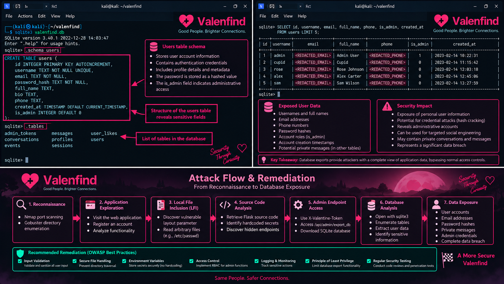

<figcaption>
Figure — Documented Valenfind attack flow from reconnaissance through database disclosure.
</figcaption>

</figure>

---

# Reconnaissance

The assessment began by identifying exposed services and web application entry points.

## Nmap Enumeration

<figure>

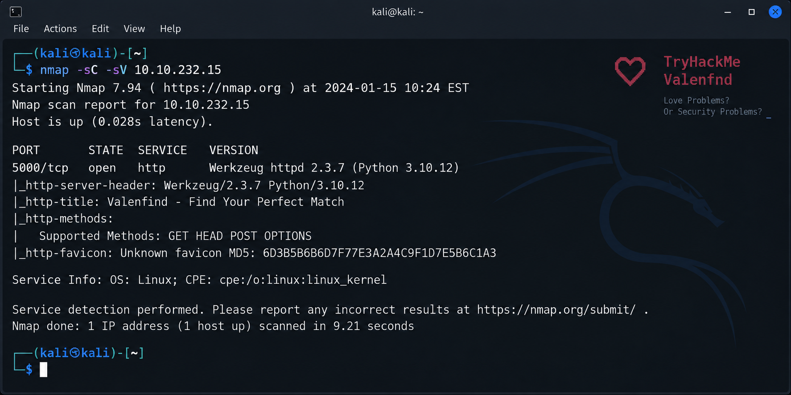

<figcaption>
Figure — Nmap reconnaissance used to identify the exposed application service.
</figcaption>

</figure>

### Objective

The purpose of the initial scan was to identify:

- Running services
- Exposed ports
- Available application entry points

### Result

The reconnaissance phase identified:

- **Port 5000**
- A **Flask web application**

This established the primary web application as the initial attack surface.

---

## Gobuster Directory Enumeration

<figure>

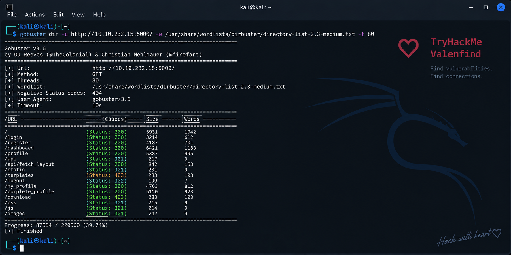

<figcaption>
Figure — Directory and resource enumeration performed during reconnaissance.
</figcaption>

</figure>

### Objective

Gobuster was used to identify additional application resources and exposed routes.

### Result

The enumeration identified additional application attack surface, including:

- Authentication-related endpoints
- API routes
- Additional application resources

The discovered routes provided additional areas for subsequent application analysis.

---

# Application Exploration

Before actively testing the application's security controls, the application was explored through normal user functionality.

This established an understanding of the expected application workflow and identified user-controlled functionality that could later be examined from a security perspective.

## Homepage

<figure>

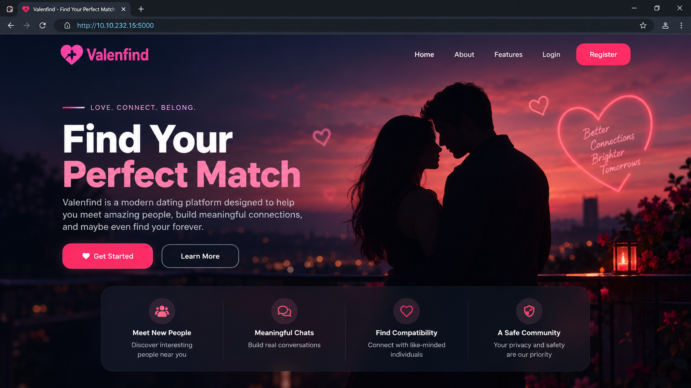

<figcaption>
Figure — Initial landing page of the Valenfind dating application.
</figcaption>

</figure>

The homepage provided the initial interface for interacting with the application.

---

## User Registration

<figure>

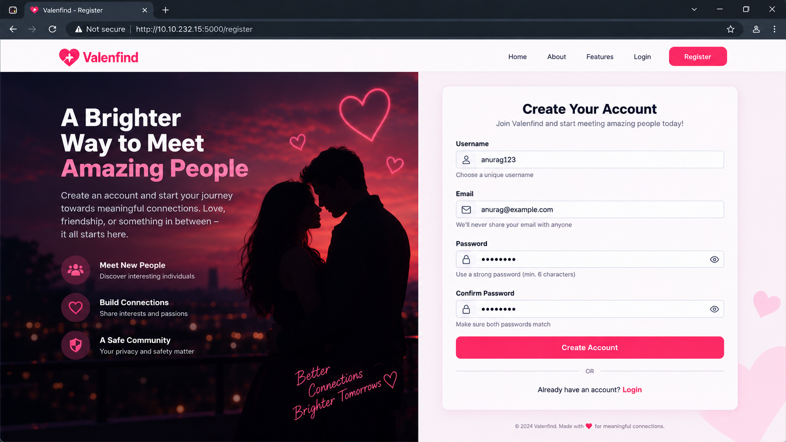

<figcaption>
Figure — User registration interface used to establish a normal application account.
</figcaption>

</figure>

A normal user account was created to enable authenticated testing of functionality that was unavailable to unauthenticated users.

---

## Complete Profile

<figure>

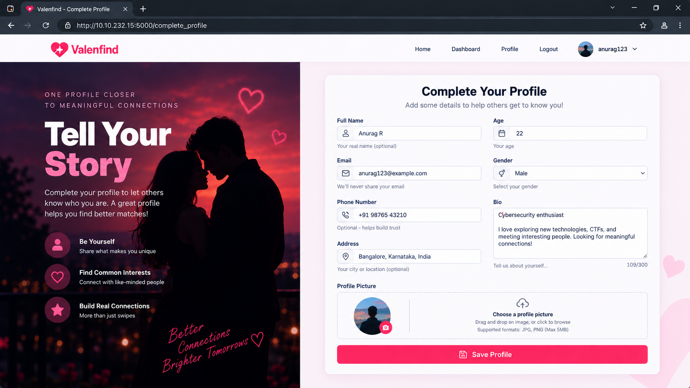

<figcaption>
Figure — Profile completion interface containing additional user-controlled fields.
</figcaption>

</figure>

Profile completion introduced additional user-controlled application functionality.

---

## Login

<figure>

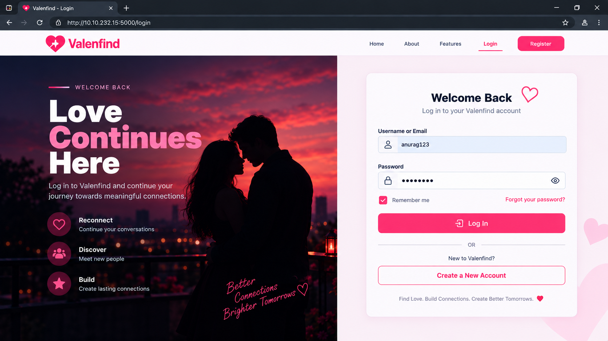

<figcaption>
Figure — Authentication interface for accessing authenticated functionality.
</figcaption>

</figure>

Successful authentication provided access to the application's internal user functionality.

---

## User Dashboard

<figure>

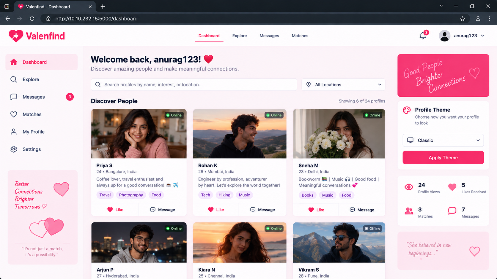

<figcaption>
Figure — Authenticated Valenfind dashboard displaying application functionality.
</figcaption>

</figure>

The dashboard provided access to the authenticated application environment.

---

## Profile Page

<figure>

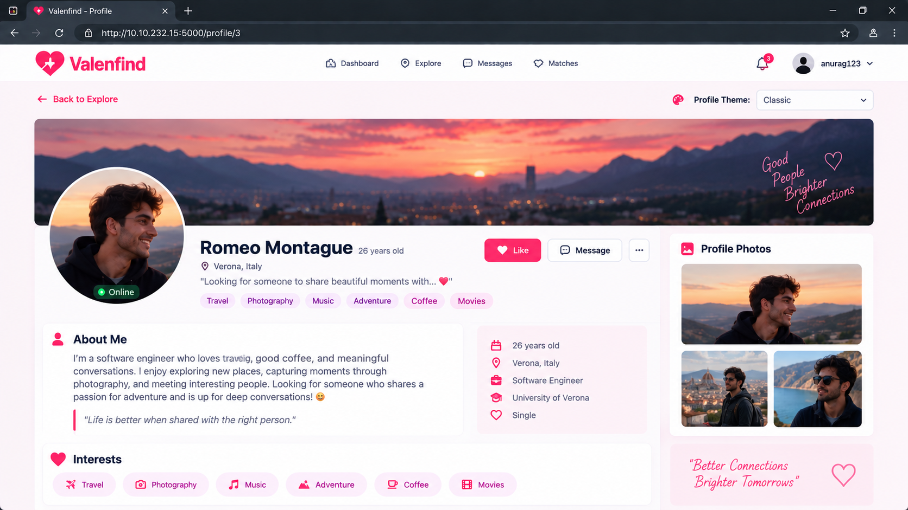

<figcaption>
Figure — Profile functionality containing the Profile Theme selector that became relevant to the later security analysis.
</figcaption>

</figure>

The **Profile Theme** selector was particularly important because it interacted with server-side functionality responsible for retrieving application layouts.

---

# Network Traffic Analysis

Browser Developer Tools were used to inspect the communication between the browser and the Flask application.

## Network Inspector

<figure>

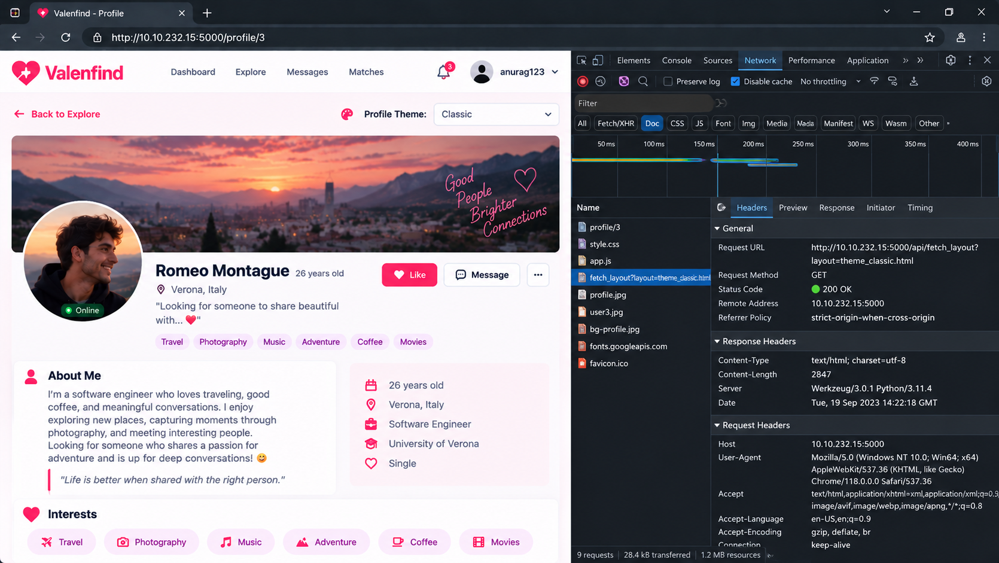

<figcaption>
Figure — Network inspection revealing the dynamic layout request.
</figcaption>

</figure>

The network inspection revealed the following request:

```http
/api/fetch_layout?layout=theme_classic.html
```

The `layout` parameter was user-controlled and therefore became an important security-testing target.

<div class="key-finding">

<div class="key-finding-title">Key Finding — User-Controlled File Parameter</div>

The application accepted a filename through the `layout` parameter. Parameters that influence server-side file selection should be carefully validated because insufficient validation can expose filesystem resources outside the application's intended directory.

</div>

---

# Local File Inclusion

The `layout` parameter was subsequently evaluated for directory traversal and Local File Inclusion behavior.

## LFI Request

<figure>

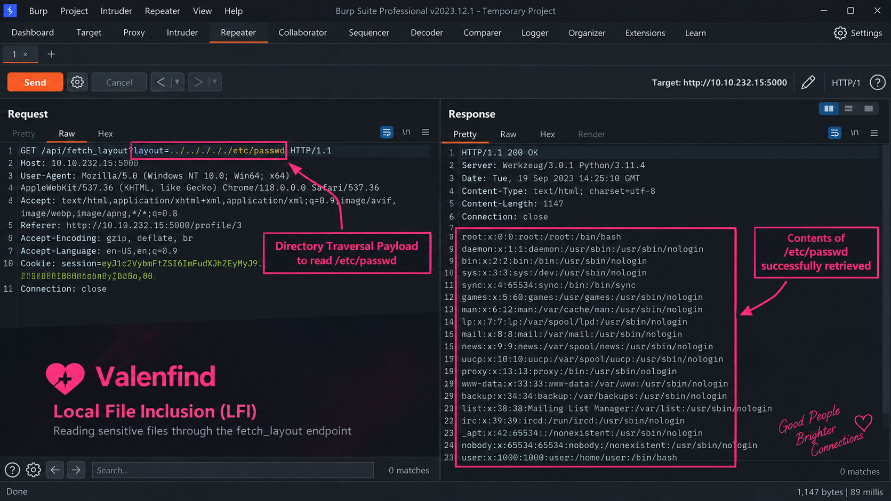

<figcaption>
Figure — Request demonstrating the documented Local File Inclusion testing.
</figcaption>

</figure>

The parameter was tested with directory traversal payloads in an attempt to access files outside the intended templates directory.

---

## Confirming Local File Inclusion

<figure>

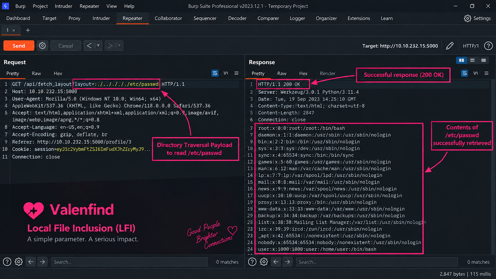

<figcaption>
Figure — Successful access to <code>/etc/passwd</code>, confirming arbitrary local file read behavior.
</figcaption>

</figure>

Access to `/etc/passwd` confirmed that the application could be manipulated into reading files outside its intended template location.

### Security Significance

The behavior demonstrated:

- Directory Traversal
- Local File Inclusion
- Improper input validation
- Arbitrary local file read capability

<div class="callout danger">

<div class="callout-title">Security Impact</div>

A file-loading parameter intended for application layouts could be redirected toward local filesystem resources. This transformed a seemingly limited theme-loading feature into a source of sensitive server-side information disclosure.

</div>

---

## Process Enumeration

<figure>

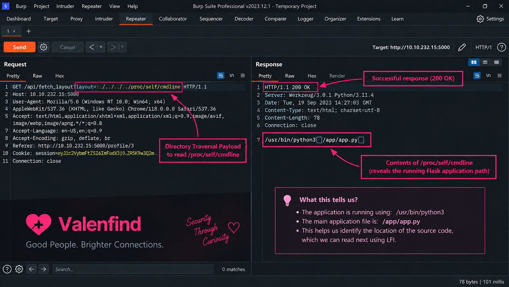

<figcaption>
Figure — Reading <code>/proc/self/cmdline</code> to identify the application's execution context.
</figcaption>

</figure>

The LFI capability was used to read:

```text
/proc/self/cmdline
```

The resulting information exposed the application's execution path and assisted in identifying the Flask project directory.

This provided a route from the initial file-read vulnerability toward application source-code discovery.

---

# Source Code Analysis

The LFI vulnerability was leveraged to read the Flask application's source code.

Source disclosure significantly expanded the available attack surface because application logic, routes, and sensitive implementation details became accessible.

## Application Source

<figure>

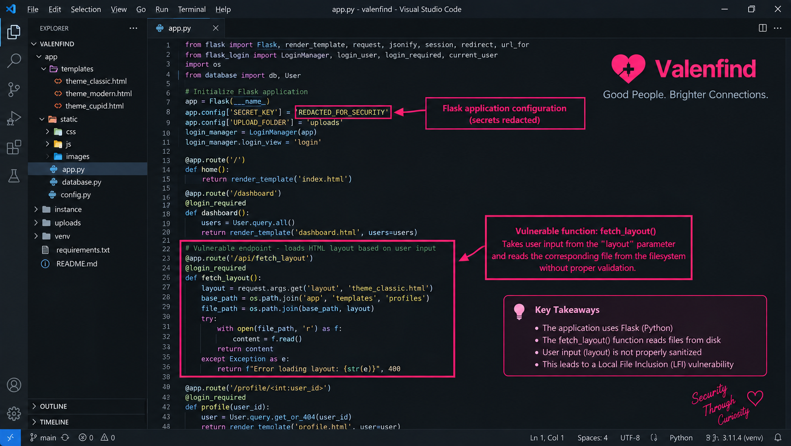

<figcaption>
Figure — Flask application source-code analysis performed after establishing local file read.
</figcaption>

</figure>

### Security Findings

The source code exposed:

- Flask routes
- Application logic
- Sensitive implementation details
- Secrets stored directly in application source

The source-code disclosure therefore provided considerably more information than the original LFI issue alone.

---

## Flask Route Review

<figure>

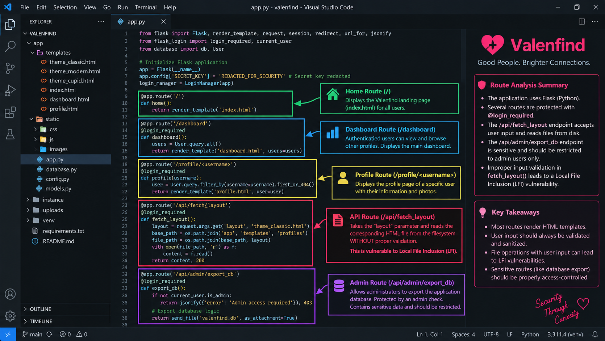

<figcaption>
Figure — Flask route review revealing application and administrative functionality.
</figcaption>

</figure>

Important functionality identified during source-code review included:

- `fetch_layout`
- Authentication routes
- A hidden administrative API

This demonstrated the value of source-code analysis after obtaining arbitrary local file read access.

---

## Hardcoded Administrative Secret

<figure>

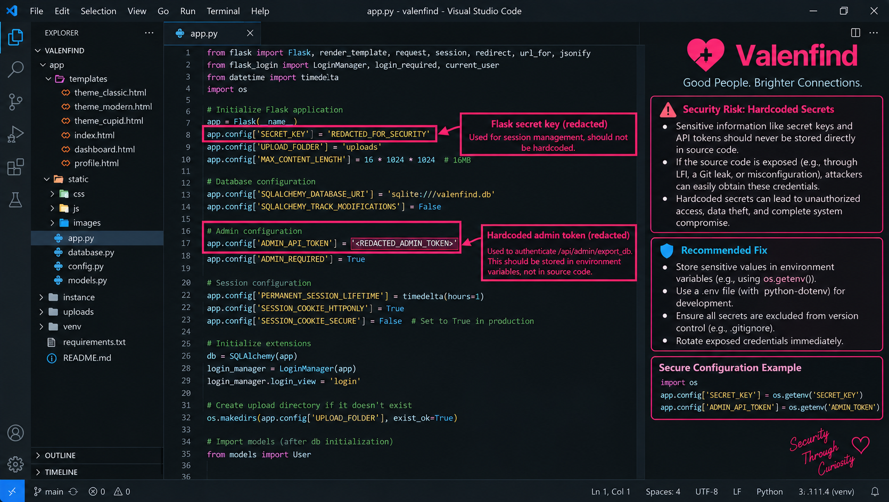

<figcaption>
Figure — Hardcoded administrative secret identified in application source; sensitive information remains redacted.
</figcaption>

</figure>

The application source contained a hardcoded administrative token.

The token was relevant to the next stage because the hidden administrative endpoint required a custom authentication header.

<div class="callout warning">

<div class="callout-title">Responsible Disclosure</div>

Administrative secrets and challenge-sensitive information have intentionally been redacted from this portfolio presentation where the original documentation indicates that they were redacted.

</div>

---

# Administrative Endpoint Discovery

Source-code review exposed a hidden administrative API endpoint.

## Hidden Administrative Route

<figure>

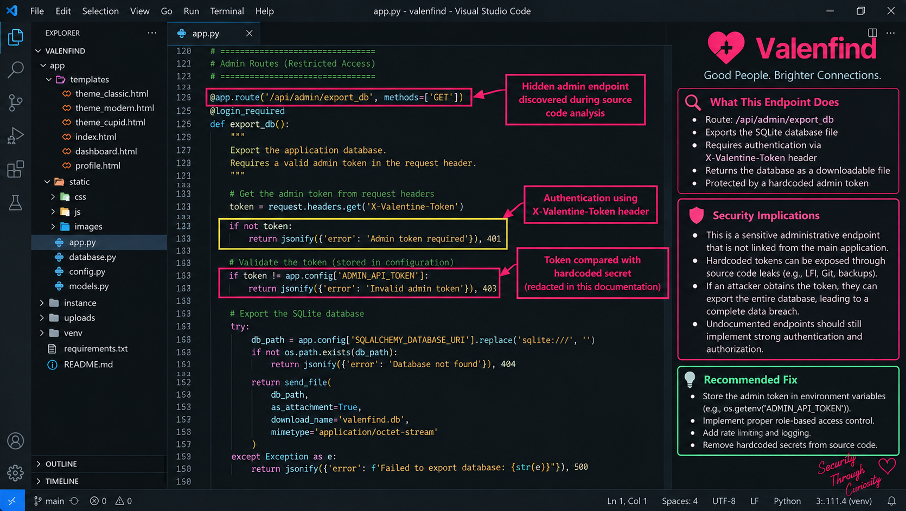

<figcaption>
Figure — Administrative endpoint identified through Flask source-code review.
</figcaption>

</figure>

The endpoint required a custom authentication header.

The combination of:

1. Local File Inclusion
2. Source-code disclosure
3. Hardcoded administrative secret

provided the information necessary to interact with this restricted functionality.

---

## Authenticated Administrative Request

<figure>

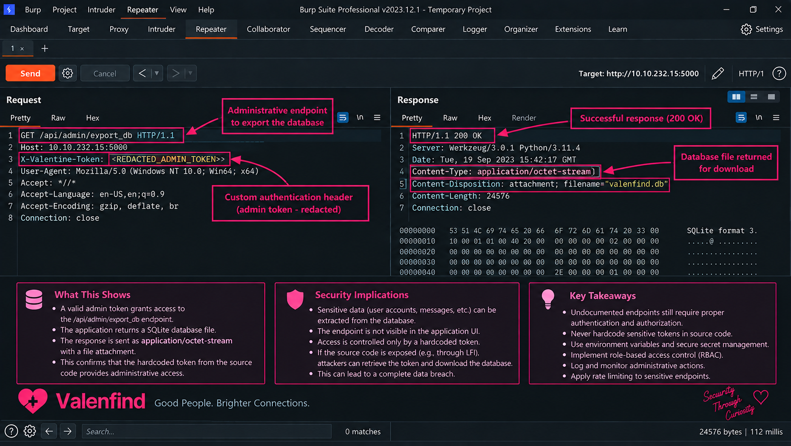

<figcaption>
Figure — Authenticated administrative request demonstrating access to backend database functionality.
</figcaption>

</figure>

After supplying the recovered administrative token, the administrative endpoint returned the application's SQLite database.

This represented a significant escalation in impact from the original file-read vulnerability.

---

# SQLite Database Analysis

The exported SQLite database was investigated locally to understand the backend data exposed through the administrative functionality.

## Database Download

<figure>

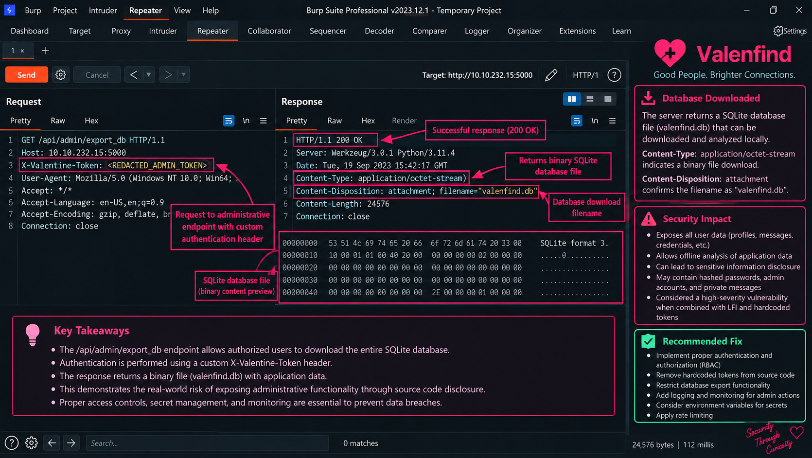

<figcaption>
Figure — Backend SQLite database obtained through the administrative endpoint.
</figcaption>

</figure>

The administrative functionality allowed the backend database to be downloaded for local analysis.

---

## SQLite Investigation

<figure>

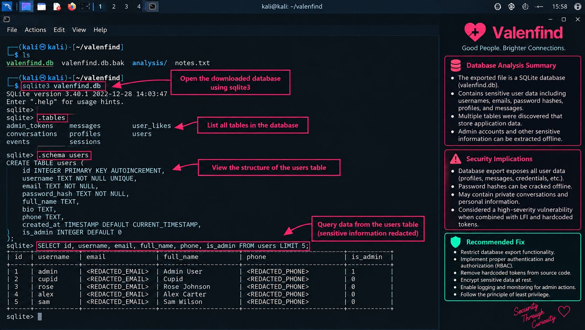

<figcaption>
Figure — SQLite database opened for schema and record analysis.
</figcaption>

</figure>

The database investigation included:

- Table identification
- Schema inspection
- User-record analysis

---

## Database Schema

<figure>


<figcaption>
Figure — Documented schema of the users data within the SQLite database.
</figcaption>

</figure>

The documented user-data schema included fields such as:

- Username
- Email
- Phone Number
- Address
- Biography
- Avatar

The presence of these fields demonstrated that unauthorized database access could expose significant user information.

---

## Sanitized User Records

<figure>


<figcaption>
Figure — Sanitized user records used as portfolio evidence while protecting sensitive information.
</figcaption>

</figure>

Sensitive information has intentionally been removed from the portfolio documentation.

<div class="callout warning">

<div class="callout-title">Responsible Disclosure</div>

Personally identifiable information, administrative secrets, passwords, and challenge flags have been redacted from the portfolio where applicable.

</div>

---

# Security Findings

The documented assessment identified multiple security weaknesses across the application's attack chain.

| Finding | Documented Risk | Evidence / Impact |
|---|---|---|
| Local File Inclusion | High | Arbitrary local file read, including `/etc/passwd` |
| Directory Traversal | High | Access to files outside the intended templates directory |
| Source Code Disclosure | Critical | Flask application source became readable |
| Hardcoded Secrets | Critical | Administrative token was present in source code |
| Sensitive Data Exposure | High | SQLite database exposed user information |
| Insecure Administrative API | High | Administrative functionality permitted database access |

<div class="key-finding">

<div class="key-finding-title">Primary Security Observation</div>

The most important lesson from the assessment is the way multiple weaknesses chained together. The initial file-loading flaw enabled local file disclosure, which enabled source-code discovery, which exposed an administrative secret, which in turn enabled access to backend database functionality.

</div>

---

# Security Impact

## Attack Chain Visualization

<figure>


<figcaption>
Figure — Complete documented attack chain and resulting security impact.
</figcaption>

</figure>

The assessment demonstrated how a single input-validation weakness could become substantially more severe when combined with insecure development practices.

The documented chain resulted in:

- Source-code disclosure
- Administrative credential exposure
- Unauthorized database export
- Sensitive information disclosure

The key security lesson is that individual vulnerabilities should not always be assessed in isolation. A relatively narrow file-read vulnerability can provide the information necessary to reach significantly more sensitive application functionality.

---

# Remediation Recommendations

The recommended controls below are derived directly from the documented vulnerabilities.

| Issue | Recommended Mitigation |
|---|---|
| Local File Inclusion | Validate filenames against an allowlist |
| Directory Traversal | Canonicalize paths and restrict filesystem access |
| Hardcoded Secrets | Store secrets in environment variables or a dedicated secrets manager |
| Administrative API | Enforce authentication and role-based authorization |
| SQLite Export | Restrict database exports and audit administrative actions |
| Sensitive Information Exposure | Encrypt sensitive data and implement least-privilege access |

## Local File Inclusion

The application should avoid accepting arbitrary filesystem paths from user-controlled input.

A strict allowlist of permitted layout identifiers should be preferred over accepting arbitrary filenames.

Where filesystem access is required, paths should be canonicalized and verified against an explicitly permitted application directory.

---

## Directory Traversal

The application should prevent traversal outside the intended resource directory.

Filesystem operations should:

- Resolve the requested path
- Verify that the resulting canonical path remains inside the permitted directory
- Reject unexpected path components
- Prefer application-level identifiers over raw filesystem paths

---

## Hardcoded Administrative Secrets

Administrative secrets should not be embedded directly in application source code.

The documented recommendation is to use:

- Environment variables
- A secrets-management system
- Proper secret rotation
- Restricted access to production credentials

This also reduces the impact of accidental source-code disclosure.

---

## Administrative API Security

Administrative functionality should enforce strong authentication and authorization.

The endpoint should verify:

- Authentication
- Administrative authorization
- Appropriate role or privilege
- Request legitimacy

Administrative operations should also be logged and monitored.

---

## Database Export Controls

Database export functionality should be tightly restricted.

Recommended controls include:

- Restricting exports to authorized administrators
- Auditing administrative export operations
- Limiting database access according to least privilege
- Protecting exported database files
- Preventing unnecessary exposure of backend storage

---

## Sensitive Information Protection

Sensitive user information should be protected through appropriate access controls and data-protection mechanisms.

The documented remediation recommends:

- Encrypting sensitive data where appropriate
- Applying least-privilege access
- Restricting administrative access
- Preventing unauthorized database disclosure

---

# Tools Used

The following tools and technologies are explicitly documented in the original walkthrough.

| Tool / Technology | Purpose |
|---|---|
| Nmap | Network and service reconnaissance |
| Gobuster | Directory and application-resource enumeration |
| Browser Developer Tools | HTTP/network request inspection |
| Python Flask | Application framework analyzed during source review |
| SQLite | Backend database investigated after administrative access |

<div class="tool-list">

<span class="tool-tag">Nmap</span>
<span class="tool-tag">Gobuster</span>
<span class="tool-tag">Browser Developer Tools</span>
<span class="tool-tag">Flask</span>
<span class="tool-tag">SQLite</span>

</div>

---

# Key Findings

<div class="key-finding">

<div class="key-finding-title">Finding 01 — User-Controlled Layout Loading</div>

The application exposed a `layout` parameter through the `/api/fetch_layout` endpoint. This parameter became the entry point for directory traversal and Local File Inclusion testing.

</div>

<div class="key-finding">

<div class="key-finding-title">Finding 02 — Arbitrary Local File Read</div>

The documented ability to retrieve `/etc/passwd` confirmed that the layout-loading functionality could access files outside its intended directory.

</div>

<div class="key-finding">

<div class="key-finding-title">Finding 03 — Source-Code Disclosure</div>

The local file-read capability enabled access to the Flask application's source code, exposing application logic and additional routes.

</div>

<div class="key-finding">

<div class="key-finding-title">Finding 04 — Hardcoded Administrative Secret</div>

The application source contained an administrative token that was subsequently relevant to accessing the hidden administrative functionality.

</div>

<div class="key-finding">

<div class="key-finding-title">Finding 05 — Database Exposure</div>

Authenticated access to the administrative functionality resulted in the application's SQLite database being returned, exposing backend user information.

</div>

---

# Lessons Learned

## Reconnaissance Comes First

Initial service and directory enumeration established the available application attack surface before deeper testing began.

Understanding exposed functionality reduced unnecessary testing and helped identify the application entry points.

## Normal Application Behavior Can Reveal Attack Surface

Exploring the application as a legitimate user exposed the Profile Theme functionality.

The subsequent network inspection revealed that the theme selection interacted with a server-side layout-loading endpoint.

## User-Controlled File Parameters Require Careful Validation

The `layout` parameter demonstrated why applications should not blindly trust user-controlled filenames.

A feature that appears to load a simple application template can become a serious security issue when filesystem boundaries are not enforced.

## Source Code Can Amplify a Vulnerability

The LFI vulnerability initially provided file-read capability.

Once application source code became accessible, additional functionality and a hardcoded administrative secret could be identified.

This demonstrates why source-code disclosure can significantly increase the impact of another vulnerability.

## Vulnerabilities Can Chain Together

The Valenfind assessment demonstrates a complete vulnerability chain:

<div class="attack-chain">

<div class="attack-step">Input Validation Failure</div>

<div class="attack-arrow">→</div>

<div class="attack-step">LFI</div>

<div class="attack-arrow">→</div>

<div class="attack-step">Source Disclosure</div>

<div class="attack-arrow">→</div>

<div class="attack-step">Secret Exposure</div>

<div class="attack-arrow">→</div>

<div class="attack-step">Admin API</div>

<div class="attack-arrow">→</div>

<div class="attack-step">Database Exposure</div>

</div>

The overall impact was substantially greater than the initial vulnerability considered independently.

## Defensive Understanding

From a defensive perspective, the room reinforces the importance of:

- Strict input validation
- Filesystem boundary enforcement
- Secure secret management
- Strong administrative authorization
- Database-access controls
- Protection of sensitive user information

---

# Repository Structure

The documented repository structure is:

```text
Valenfind-TryHackMe-Walkthrough/
├── README.md
├── Documentation/
│   └── Valenfind_Documentation.md
├── Resources/
│   └── notes.md
├── docs/
│   ├── index.md
│   └── assets/
│       ├── room-banner.png
│       ├── recon/
│       ├── application/
│       ├── lfi/
│       ├── source-analysis/
│       ├── database/
│       └── remediation/
└── LICENSE
```

The GitHub Pages documentation uses the assets stored beneath `docs/assets/`.

---

# Full Technical Documentation

The repository also contains the complete technical walkthrough with the detailed methodology, commands, explanations, and supporting screenshots.

**[View Complete Technical Documentation](../Documentation/Valenfind_Documentation.md)**

---

# Room Reference

The original documentation identifies the challenge as the **Valenfind** room on TryHackMe.

**Platform:** [TryHackMe](https://tryhackme.com/)

**Room:** Valenfind

---

# Responsible Use

> This documentation was created for authorized cybersecurity training and CTF environments. Techniques described here should only be used against systems for which you have explicit permission to test.

The techniques demonstrated in this documentation are intended for controlled educational environments and security research.

Sensitive information shown in the original material has been intentionally redacted where applicable for responsible portfolio publication.

---

# Conclusion

The **Valenfind** room demonstrates how a seemingly narrow input-validation issue can develop into a broader application compromise when combined with insecure development practices.

The documented attack began with reconnaissance and application enumeration, progressed through network request analysis and Local File Inclusion, and ultimately enabled Flask source-code disclosure, administrative secret discovery, administrative API access, and SQLite database exposure.

The assessment highlights several important application-security principles:

- User-controlled filesystem parameters require strict validation.
- Directory traversal must be prevented through secure path handling.
- Application source code should not expose secrets.
- Administrative functionality requires strong authentication and authorization.
- Backend databases should never be unnecessarily exposed.
- Sensitive user information requires appropriate access controls.

From a penetration-testing perspective, the room demonstrates the importance of following evidence from one stage of an assessment into the next rather than treating individual findings as isolated issues.

From a defensive perspective, it demonstrates how multiple weaknesses can combine to produce a substantially larger security impact.

---
